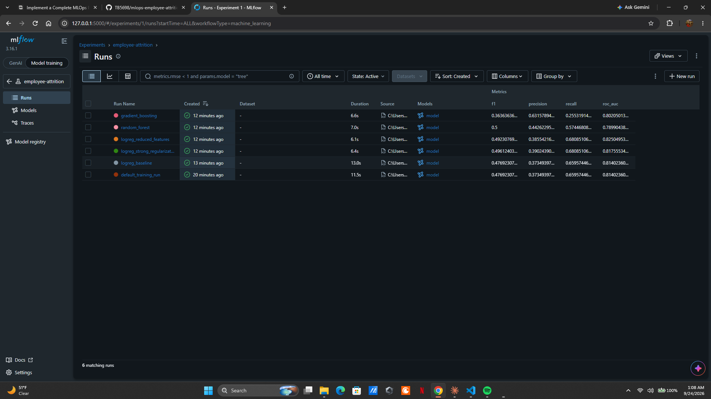

# Employee Attrition: End-to-End MLOps Pipeline


This project takes a simple classification model and builds the production-style infrastructure around it: version control with Git and DVC, experiment tracking with MLflow, automated tests with pytest, a CI/CD pipeline with GitHub Actions, and drift monitoring with Evidently. The model predicts whether an employee is likely to leave the company. The focus is on the pipeline, not on squeezing out the best possible score.

## Dataset

I used the **IBM HR Analytics Employee Attrition & Performance** dataset. It is a sample dataset created by IBM, published in IBM's [employee-attrition-aif360](https://github.com/IBM/employee-attrition-aif360) repository and also on [Kaggle](https://www.kaggle.com/datasets/pavansubhasht/ibm-hr-analytics-attrition-dataset).

- **Prediction task:** binary classification of `Attrition` (Yes = the employee left, No = stayed). About 16% of employees left, so the classes are imbalanced.
- **Size:** 1,470 rows and 35 columns. After dropping 4 columns that carry no information (three hold the same value in every row, and one is an ID number), there are 30 features: 23 numeric and 7 categorical.
- **Missing values:** the original file has none, so I simulate them. `src/preprocess.py` blanks out 5% of the values in five columns (3 numeric, 2 categorical) with a fixed random seed, and the pipeline fills them back in with median and most-frequent imputation. The columns, rate, and seed are set in `configs/config.yaml`.

The CSV is tracked with DVC, not committed to Git. See [Data versioning with DVC](#data-versioning-with-dvc) below.

## Project structure

```
mlops-employee-attrition/
├── .github/workflows/ci.yml     # GitHub Actions: test job, then train job
├── configs/
│   ├── config.yaml              # Paths, features, hyperparameters, thresholds, monitoring settings
│   └── experiments.yaml         # The five MLflow experiments
├── data/raw/
│   └── employee_attrition.csv.dvc   # DVC pointer file (the CSV itself is not in Git)
├── docs/mlflow_runs.png         # Screenshot of my MLflow runs
├── src/
│   ├── utils.py                 # Config loading and file hashing
│   ├── preprocess.py            # Loading, cleaning, simulated missing values, sklearn preprocessor
│   ├── train.py                 # Training, MLflow logging, threshold check
│   ├── evaluate.py              # Metrics and threshold logic
│   ├── run_experiments.py       # Runs all five experiments
│   ├── compare_experiments.py   # Finds the best run with mlflow.search_runs()
│   ├── monitor_drift.py         # Evidently drift check and HTML report
│   └── drift_impact.py          # Measures how the drift changes model performance
├── tests/
│   ├── conftest.py              # Shared fixtures
│   ├── test_preprocess.py       # Unit tests
│   ├── test_data_validation.py  # Data validation tests on the real dataset
│   └── test_model.py            # Model validation tests
├── MONITORING.md                # Drift analysis write-up
├── pytest.ini
└── requirements.txt             # Pinned dependency versions
```

## Setup

I built and tested this with **Python 3.12**. The pinned versions in `requirements.txt` support Python 3.11 through 3.14, but 3.12 is what the CI pipeline uses.

```
git clone https://github.com/TB5698/mlops-employee-attrition.git
cd mlops-employee-attrition
python -m venv .venv
```

Activate the virtual environment:

```
# Windows (PowerShell)
.venv\Scripts\Activate.ps1

# macOS / Linux
source .venv/bin/activate
```

Install the dependencies and download the dataset:

```
pip install -r requirements.txt
dvc pull
```

After `dvc pull`, the dataset is at `data/raw/employee_attrition.csv`.

## Data versioning with DVC

DVC is initialized in this repo (`.dvc/`), and the dataset is tracked by the pointer file `data/raw/employee_attrition.csv.dvc`. The CSV itself is excluded from Git by `.gitignore`.

I added the dataset with `dvc import-url`, pointing at IBM's public copy of the file. The pointer file records where the data comes from and its checksum, so **`dvc pull` works on any machine**, including the GitHub Actions runners, without access to my computer. A local DVC remote (`localremote`) is also configured in `.dvc/config` for my own machine, but you don't need it to reproduce the project.

Because the file is imported rather than added, `dvc status` lists it as changed after a pull. That is expected for URL imports and does not mean anything is wrong.

## Configuration

Every script reads its settings from `configs/config.yaml` instead of hardcoding them:

| Section | What it controls |
|---|---|
| `data` | File paths, target column, columns to drop |
| `features` | Numeric and categorical feature lists, plus optional exclusions |
| `missing_values` | Which columns get simulated missing values, the rate, and the seed |
| `split` | Test set size and random seed |
| `model` | Model type and hyperparameters |
| `mlflow` | Tracking URI, experiment name, run name |
| `evaluation` | Primary metric and the minimum thresholds training must meet |
| `monitoring` | Drift tests, alert threshold, and the simulated drift scenario |

## Training

```
python -m src.train --config configs/config.yaml
```

This trains a logistic regression pipeline (imputation, scaling, and one-hot encoding, then the model), evaluates it on a stratified 20% test set, and logs the run to MLflow. It prints the metrics and **exits with code 1 if any threshold in `evaluation.thresholds` is missed**:

| Metric | Minimum | Default model |
|---|---|---|
| ROC-AUC (primary) | 0.75 | 0.814 |
| F1 | 0.40 | 0.477 |
| Recall | 0.50 | 0.660 |

I chose **ROC-AUC as the primary metric** because only 16% of employees leave. Accuracy would look good even for a model that never predicts anyone leaving, while ROC-AUC measures how well the model ranks people who leave above people who stay. I also track F1, recall, precision, and accuracy.

## Experiment tracking with MLflow

Every training run logs:

- **Parameters:** model type, every model hyperparameter, test size, random seed, missing value rate, feature counts, and any excluded features.
- **Data version:** the MD5 hash of the dataset file (`data_version`), which matches DVC's hash, plus tags for the data path and DVC pointer file.
- **Metrics:** ROC-AUC, F1, recall, precision, and accuracy on the test set.
- **Model:** the full sklearn pipeline, logged with `mlflow.sklearn.log_model()` along with its input signature and an input example.

Tracking data is stored locally in `mlflow.db` (SQLite), which is excluded from Git.

### Running the five experiments

```
python -m src.run_experiments
```

This runs every experiment in `configs/experiments.yaml` on top of the base config:

| Run | What changes | ROC-AUC | F1 | Recall | Precision |
|---|---|---|---|---|---|
| logreg_baseline | Base config | 0.8140 | 0.4769 | 0.6596 | 0.3735 |
| logreg_strong_regularization | C = 0.05 | 0.8176 | 0.4961 | 0.6809 | 0.3902 |
| logreg_reduced_features | Drops DailyRate, HourlyRate, MonthlyRate | **0.8250** | 0.4923 | 0.6809 | 0.3855 |
| random_forest | Random forest, 300 trees | 0.7899 | 0.5000 | 0.5745 | 0.4426 |
| gradient_boosting | Gradient boosting, 200 trees | 0.8021 | 0.3636 | 0.2553 | 0.6316 |

Together these cover all three kinds of variation: hyperparameters, feature sets, and model types.

### Finding the best run

```
python -m src.compare_experiments
```

This uses `mlflow.search_runs()` to pull every finished run, sort by the primary metric, and report the best one. The best run was **logreg_reduced_features** (ROC-AUC 0.825). Dropping the three "rate" columns, which look like random noise, helped a little.

### Viewing the runs in the MLflow UI

```
mlflow ui --backend-store-uri sqlite:///mlflow.db --workers 1
```

Then open http://127.0.0.1:5000 and click **Training runs**. I use `--workers 1` because on Windows the default of four workers can crash with `WinError 10022`. Here are my runs:



## Testing

```
pytest tests/ -v
```

There are 46 tests at three levels:

| File | Level | Tests | What they check |
|---|---|---|---|
| `test_preprocess.py` | Unit | 19 | Missing values are handled, categoricals are encoded, the original dataframe is never modified, and invalid input raises clear errors |
| `test_data_validation.py` | Data validation | 21 | On the real dataset: enough rows, expected columns present, target is only Yes/No with a sensible balance, numeric features within expected ranges, no blank categories, unique employee IDs |
| `test_model.py` | Model validation | 6 | A model trained on a 600-row sample returns predictions of the right type and shape, valid probabilities, and at least 0.70 ROC-AUC on the held-out test set. It also handles missing values at prediction time |

The data validation and model tests need the dataset, so run `dvc pull` first.

## CI/CD with GitHub Actions

`.github/workflows/ci.yml` runs on every push to `main` and every pull request that targets `main`. It has two jobs:

1. **Run tests:** installs the pinned requirements, runs `dvc pull`, and runs the full pytest suite.
2. **Train and validate the model:** only starts if the test job passes (`needs: test`). It installs, pulls the data, and runs `src/train.py`. If the model misses any threshold, the script exits with code 1 and the pipeline fails. The run's MLflow data is saved as a downloadable artifact.

The run history is in the repo's **Actions** tab.

## Drift monitoring with Evidently

```
python -m src.monitor_drift
```

This compares the training data (reference) against a simulated production batch, which is the held-out rows with a "hiring wave during a busy season" scenario applied. It runs Evidently drift tests on all 30 features, prints which ones drifted and the overall drift share, saves an HTML report to `reports/drift_report.html`, and **exits with code 1 if the drift share is above `monitoring.drift_share_threshold`** (20%).

With the default settings, 5 of 30 features drift (16.7%), so the check passes. To see the alert and exit code 1, lower the threshold:

```
python -m src.monitor_drift --threshold 0.1
```

To measure how the drift changes the model's predictions:

```
python -m src.drift_impact
```

My written analysis (which features drifted and why, whether it would affect performance, and what I would do about it) is in **[MONITORING.md](MONITORING.md)**.

## What I would improve next

- Promote the best experiment (reduced features) to the default config after checking it on more data.
- Add per-feature drift alerts for the most important predictors, as described in MONITORING.md.
- Move the DVC remote and MLflow tracking to shared cloud storage so a whole team could use them.